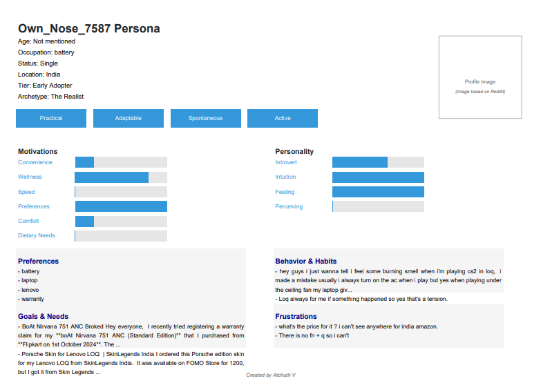

## 🧠 Reddit User Persona Generator

A smart script-based system that fetches Reddit user data and generates a **visually appealing, one-page persona PDF**, capturing user behavior, preferences, goals, and personality traits — useful for research, marketing, or user modeling.

## 🚀 Features

- 🔎 Fetches Reddit user's posts & comments using Reddit API (via PRAW)
- 📊 Analyzes behavior to extract:
  - Motivations
  - Preferences
  - Personality traits
  - Goals & Frustrations
- 🧾 Generates a **clean, themed PDF** with:
  - Profile section
  - Trait bars
  - Behavioral tags
  - Bullet-point insights
- 🧠 Light semantic analysis powered by keyword scoring
- ✅ ASCII-safe and Unicode-clean text processing

---

## 📁 Project Structure

```

reddit-user-persona/
│
├── analyser.py        # Extracts motivations, preferences, personality, goals, etc.
├── bullet.py          # Utility to clean and truncate list items for the PDF
├── fetcher.py         # Pulls recent posts & comments of a Reddit user
├── main.py            # Main entrypoint to run the persona generation
├── pdf\_generator.py   # Generates the PDF using FPDF with modern theming
├── reddit\_client.py   # Authenticates and sets up Reddit API client (PRAW)
├── utils.py           # Shared helper functions (normalization, scoring, etc.)
├── requirements.txt   # All dependencies (PRAW, FPDF, etc.)
└── README.md          # (This file)

````

---

## 🛠️ Requirements

Install dependencies using:

```bash
pip install -r requirements.txt
````

**Dependencies:**

* `fpdf` – for PDF generation
* `praw` – Reddit API wrapper
* `unicodedata`, `re` – for text preprocessing

---

## 🔧 Setup

1. **Get Reddit API credentials**
   Create a Reddit app at [https://www.reddit.com/prefs/apps](https://www.reddit.com/prefs/apps) and add your credentials to `reddit_client.py`:

```python
# reddit_client.py
import praw

reddit = praw.Reddit(
    client_id='YOUR_CLIENT_ID',
    client_secret='YOUR_CLIENT_SECRET',
    user_agent='persona-generator by u/YOUR_USERNAME'
)
```

2. **Run the program**

```bash
python main.py
```

Enter a Reddit username when prompted (e.g. `u/elonmusk`) — the script will generate:

```
✅ Themed PDF saved to elonmusk_persona.pdf
```

---

## 📄 Example Output



> *(Add a real screenshot here of the generated PDF for better visual appeal)*

---

## ✨ Highlights

* Completely offline PDF generation — no external font or design tools needed
* One-page, human-readable structure for easy profiling
* Useful for:

  * UX research
  * Marketing audience personas
  * Social media behavior studies
  * AI user modeling projects

---

## ⚠️ Disclaimer

This tool is intended for educational or analytical use. Please ensure you comply with Reddit’s API usage policies and ethical use of user data.

---

## 📌 TODO / Ideas for Future

* [ ] Add profile image download if available
* [ ] Export multiple usernames in batch
* [ ] Enhance analysis using sentiment or topic modeling (NLTK or transformers)
* [ ] Deploy as a Streamlit web app for UI-based generation

---

## 🧑‍💻 Author

**Atchuth Pavan Sai Vutukuri** — Atchuth V --> https://github.com/Atchuth01


---

```

